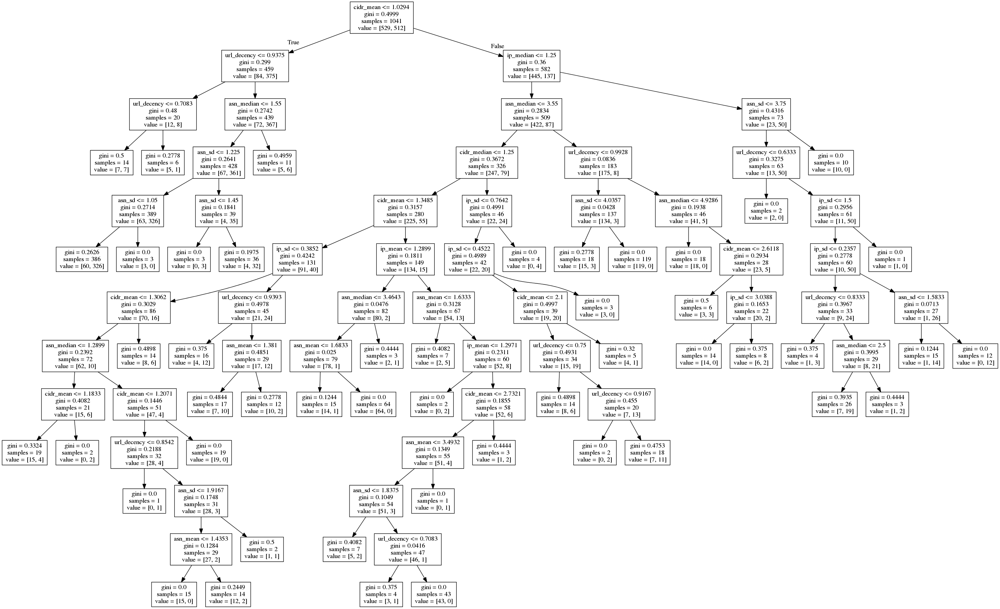
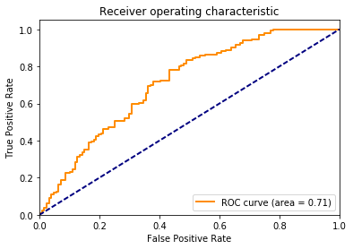

PROCESS:
1. Collect Blacklist crawled data (500 successful crawl)
2. Collect Whitelist crawled data (500 top alexa)
3. Add column malicious/benign on blacklist and whitelist
4. Merge data frames together
5. Collect features (network diversity and url decency)
6. Shuffle Data
7. Decision Tree generation
8. SVM Linear ROC generation

Disclaimer: Portion of these codes collected from
- Using-machine-learning-to-detect-maclicious-URLs (https://github.com/faizann24/Using-machine-learning-to-detect-malicious-URLs)
- Receiver Operating Characteristic (http://scikit-learn.org/stable/auto_examples/model_selection/plot_roc.html)
- Decision trees in python with scikit-learn and pandas (http://chrisstrelioff.ws/sandbox/2015/06/08/decision_trees_in_python_with_scikit_learn_and_pandas.html)


```python
import pandas as pd
import json
import pyasn
import socket
from urllib.parse import urlparse
import numpy as np

##########ML Labeler for url string decency analysis#################
#code stolen from https://github.com/faizann24/Using-machine-learning-to-detect-malicious-URLs
import pandas as pd
import numpy as np
import random
from sklearn.feature_extraction.text import TfidfVectorizer
from sklearn.feature_extraction.text import CountVectorizer
from sklearn.model_selection import train_test_split
from sklearn.linear_model import LogisticRegression
import sys
import os


def getTokens(input):
    tokensBySlash = str(input.encode('utf-8')).split('/')	#get tokens after splitting by slash
    allTokens = []
    for i in tokensBySlash:
        tokens = str(i).split('-')	#get tokens after splitting by dash
        tokensByDot = []
        for j in range(0,len(tokens)):
            tempTokens = str(tokens[j]).split('.')	#get tokens after splitting by dot
            tokensByDot = tokensByDot + tempTokens
        allTokens = allTokens + tokens + tokensByDot
    allTokens = list(set(allTokens))	#remove redundant tokens
    if 'com' in allTokens:
        allTokens.remove('com')	#removing .com since it occurs a lot of times and it should not be included in our features
    return allTokens

def TL():
    allurls = './data.csv'	#path to our all urls file
    allurlscsv = pd.read_csv(allurls,',',error_bad_lines=False)	#reading file
    allurlsdata = pd.DataFrame(allurlscsv)	#converting to a dataframe

    allurlsdata = np.array(allurlsdata)	#converting it into an array
    random.shuffle(allurlsdata)	#shuffling

    y = [d[1] for d in allurlsdata]	#all labels 
    corpus = [d[0] for d in allurlsdata]	#all urls corresponding to a label (either good or bad)
    vectorizer = TfidfVectorizer(tokenizer=getTokens)	#get a vector for each url but use our customized tokenizer
    X = vectorizer.fit_transform(corpus)	#get the X vector

    X_train, X_test, y_train, y_test = train_test_split(X, y, test_size=0.2, random_state=42)	#split into training and testing set 80/20 ratio

    lgs = LogisticRegression()	#using logistic regression
    lgs.fit(X_train, y_train)
    print(lgs.score(X_test, y_test))	#pring the score. It comes out to be 98%
    return vectorizer, lgs
vectorizer, lgs  = TL()
#example usage
#X_predict = df_network_features['url'].tolist()
#X_predict = vectorizer.transform(X_predict)
#y_Predict = lgs.predict(X_predict)
##############################################################

def getHostIP_ASN_CIDR_array(url):
    ip_addr = "N/A"
    asn = "N/A"
    cidr = "N/A"
    try:
        if not urlparse(url).scheme:
            url = "http://"+url
        if urlparse(url).hostname :
            ip_addr = socket.gethostbyname(urlparse(url).hostname)
            asn, cidr =  asndb.lookup(ip_addr)
        return [url, ip_addr, asn, cidr]
    except:
        return [url, ip_addr, asn, cidr]

#load asn db: required for ip/asn/cidr lookup
asndb_file = "/nethome/srashed3/scripts/ipasn_20170403.dat"
asndb = pyasn.pyasn(asndb_file)
```

URL String Decency ML (LR) Accuracy:  0.984136610657


```python
#Collect Blacklist crawled data (500 successful crawl)
crawl_data = "/home/crawler/mlcrawler6262/crawler/bl-crawler/data/crawldata-15-04-17-1326.json"
#crawl_data = "/home/crawler/mlcrawler6262/crawler/crawler-scrapy/alexatop/data/crawldata-15-04-17-0001.json"

line_chunk = 7000

#open number of lines in dataframe
with open(crawl_data) as myfile:
    dfElement = pd.DataFrame(json.loads(next(myfile)) for x in range(line_chunk))
    dfElement = dfElement[dfElement['crawl_status']=='OK'][['url','urls','date']]
    dfElement['label'] = 'MALICIOUS'


dfElement.shape
#url_ip_map = pd.DataFrame([getHostIP_ASN_CIDR_array(url) for url in dfElement['url']], columns=['url','ip','asn','cidr'])
```


Blacklist Sample:  (511, 4)


```python
#Collect Whitelist crawled data (500 top alexa)
crawl_data = "/home/crawler/mlcrawler6262/crawler/crawler-scrapy/alexatop/data/crawldata-15-04-17-0001.json"
asndb_file = "/nethome/srashed3/scripts/ipasn_20170403.dat"
line_chunk = 550

#open number of lines in dataframe
with open(crawl_data) as myfile:
    dfElementWL = pd.DataFrame(json.loads(next(myfile)) for x in range(line_chunk))
    dfElementWL = dfElementWL[dfElementWL['crawl_status']=='OK'][['url','urls','date']]
    dfElementWL['label'] = 'BENIGN'
dfElementWL.shape
```


Whitelist Sample:  (528, 4)


```python
#Merge data frames together
dfElement = dfElement.append(dfElementWL)
dfElement.shape
```


Total Sample:  (1039, 4)


```python
#Collect features (network diversity and url decency)
#for each url, get all url inside a list(not getting js_urls as its already coming in url)
list_url_network_features = list()
for index, row in dfElement.iterrows():
    all_url_list = []
    all_url_list = row['urls']
    all_url_list.append(row['url'])
    all_url_list = set(all_url_list)
    url_ip_map = pd.DataFrame([getHostIP_ASN_CIDR_array(url) for url in all_url_list], columns=['url','ip','asn','cidr'])
    url_ip_map = url_ip_map.replace('N/A',np.NaN)
    url_ip_map = url_ip_map.dropna()

    
    mean_of_ip, median_of_ip, sd_of_ip = np.nan, np.nan, np.nan
    mean_of_cidr, median_of_cidr, sd_of_cidr = np.nan, np.nan, np.nan 
    mean_of_asn, median_of_asn, sd_of_asn = np.nan, np.nan, np.nan
    url_decency_ratio = np.nan
    
    #aggregation: network diversity based statistical feature
    temp_dfs = url_ip_map.pivot_table(index=['ip'], values=['url'], aggfunc='count')
    if temp_dfs['url'].count() > 0:
        mean_of_ip = np.mean(temp_dfs['url'].values)
        median_of_ip = np.median(temp_dfs['url'].values)
        sd_of_ip = np.std(temp_dfs['url'].values)
        
    temp_dfs = url_ip_map.pivot_table(index=['cidr'], values=['url'], aggfunc='count')
    if temp_dfs['url'].count() > 0:
        mean_of_cidr = np.mean(temp_dfs['url'].values)
        median_of_cidr = np.median(temp_dfs['url'].values)
        sd_of_cidr = np.median(temp_dfs['url'].values)
    
    temp_dfs = url_ip_map.pivot_table(index=['asn'], values=['url'], aggfunc='count')
    if temp_dfs['url'].count() > 0:
        mean_of_asn = np.mean(temp_dfs['url'].values)
        median_of_asn = np.mean(temp_dfs['url'].values)
        sd_of_asn = np.mean(temp_dfs['url'].values)
    
    #aggregation: url string based decency ratio
    X_predict = list(all_url_list)
    X_predict = vectorizer.transform(X_predict)
    y_Predict = lgs.predict(X_predict)
    url_decency_ratio = y_Predict.tolist().count('bad') / len(y_Predict)
    
    
    list_url_network_features.append([row['url'],mean_of_ip, median_of_ip, sd_of_ip, 
                                 mean_of_cidr, median_of_cidr, sd_of_cidr,
                                 mean_of_asn, median_of_asn, sd_of_asn, url_decency_ratio,row['label']])

df_network_features = pd.DataFrame(list_url_network_features, columns=['url','ip_mean','ip_median','ip_sd', 
                                                                     'cidr_mean','cidr_median','cidr_sd',
                                                                    'asn_mean', 'asn_median', 'asn_sd', 'url_decency','label'])
#save feature to file (for future use)
df_network_features.to_csv("mlcrawler6262_feature.csv", sep=',')
```


```python
df_network_features = df_network_features.merge(dfElement[['url','label']], how='inner', on='url')
df_network_features.to_csv("test_dataset.csv",sep=',')
```


```python
import gc
gc.collect()

```


Clearing Up the Memory:  4646


# ML STUFF


```python
df_network_features = pd.read_csv("test_dataset.csv")

del df_network_features['Unnamed: 0'] #delete the index columns
del df_network_features['url'] #delete the url column - this isn't going into classifier
#del df_network_features['url_decency']
df_network_features = df_network_features.sample(frac=1).reset_index(drop=True)
df_network_features
```


<div>
<table border="1" class="dataframe">
  <thead>
    <tr style="text-align: right;">
      <th></th>
      <th>ip_mean</th>
      <th>ip_median</th>
      <th>ip_sd</th>
      <th>cidr_mean</th>
      <th>cidr_median</th>
      <th>cidr_sd</th>
      <th>asn_mean</th>
      <th>asn_median</th>
      <th>asn_sd</th>
      <th>url_decency</th>
      <th>label</th>
    </tr>
  </thead>
  <tbody>
    <tr>
      <th>0</th>
      <td>1.166667</td>
      <td>1.0</td>
      <td>0.372678</td>
      <td>1.400000</td>
      <td>1.0</td>
      <td>1.0</td>
      <td>1.750000</td>
      <td>1.750000</td>
      <td>1.750000</td>
      <td>1.000000</td>
      <td>BENIGN</td>
    </tr>
    <tr>
      <th>1</th>
      <td>1.000000</td>
      <td>1.0</td>
      <td>0.000000</td>
      <td>1.000000</td>
      <td>1.0</td>
      <td>1.0</td>
      <td>1.000000</td>
      <td>1.000000</td>
      <td>1.000000</td>
      <td>1.000000</td>
      <td>BENIGN</td>
    </tr>
    <tr>
      <th>2</th>
      <td>1.000000</td>
      <td>1.0</td>
      <td>0.000000</td>
      <td>1.000000</td>
      <td>1.0</td>
      <td>1.0</td>
      <td>1.000000</td>
      <td>1.000000</td>
      <td>1.000000</td>
      <td>1.000000</td>
      <td>MALICIOUS</td>
    </tr>
    <tr>
      <th>3</th>
      <td>1.538462</td>
      <td>1.0</td>
      <td>1.865285</td>
      <td>2.000000</td>
      <td>1.0</td>
      <td>1.0</td>
      <td>2.857143</td>
      <td>2.857143</td>
      <td>2.857143</td>
      <td>0.952381</td>
      <td>BENIGN</td>
    </tr>
    <tr>
      <th>4</th>
      <td>1.288889</td>
      <td>1.0</td>
      <td>0.778095</td>
      <td>3.515152</td>
      <td>3.0</td>
      <td>3.0</td>
      <td>8.923077</td>
      <td>8.923077</td>
      <td>8.923077</td>
      <td>0.974138</td>
      <td>BENIGN</td>
    </tr>
    <tr>
      <th>5</th>
      <td>1.333333</td>
      <td>1.0</td>
      <td>0.471405</td>
      <td>1.600000</td>
      <td>1.0</td>
      <td>1.0</td>
      <td>1.600000</td>
      <td>1.600000</td>
      <td>1.600000</td>
      <td>1.000000</td>
      <td>MALICIOUS</td>
    </tr>
    <tr>
      <th>6</th>
      <td>3.000000</td>
      <td>3.0</td>
      <td>0.000000</td>
      <td>3.000000</td>
      <td>3.0</td>
      <td>3.0</td>
      <td>3.000000</td>
      <td>3.000000</td>
      <td>3.000000</td>
      <td>0.666667</td>
      <td>MALICIOUS</td>
    </tr>
    <tr>
      <th>7</th>
      <td>1.000000</td>
      <td>1.0</td>
      <td>0.000000</td>
      <td>1.000000</td>
      <td>1.0</td>
      <td>1.0</td>
      <td>1.000000</td>
      <td>1.000000</td>
      <td>1.000000</td>
      <td>1.000000</td>
      <td>MALICIOUS</td>
    </tr>
    <tr>
      <th>8</th>
      <td>1.000000</td>
      <td>1.0</td>
      <td>0.000000</td>
      <td>1.000000</td>
      <td>1.0</td>
      <td>1.0</td>
      <td>1.000000</td>
      <td>1.000000</td>
      <td>1.000000</td>
      <td>1.000000</td>
      <td>BENIGN</td>
    </tr>
    <tr>
      <th>9</th>
      <td>1.166667</td>
      <td>1.0</td>
      <td>0.372678</td>
      <td>1.750000</td>
      <td>1.5</td>
      <td>1.5</td>
      <td>2.333333</td>
      <td>2.333333</td>
      <td>2.333333</td>
      <td>1.000000</td>
      <td>BENIGN</td>
    </tr>
    <tr>
      <th>10</th>
      <td>1.000000</td>
      <td>1.0</td>
      <td>0.000000</td>
      <td>1.000000</td>
      <td>1.0</td>
      <td>1.0</td>
      <td>1.500000</td>
      <td>1.500000</td>
      <td>1.500000</td>
      <td>1.000000</td>
      <td>MALICIOUS</td>
    </tr>
    <tr>
      <th>11</th>
      <td>1.024390</td>
      <td>1.0</td>
      <td>0.154257</td>
      <td>2.210526</td>
      <td>1.0</td>
      <td>1.0</td>
      <td>8.400000</td>
      <td>8.400000</td>
      <td>8.400000</td>
      <td>0.930233</td>
      <td>BENIGN</td>
    </tr>
    <tr>
      <th>12</th>
      <td>1.000000</td>
      <td>1.0</td>
      <td>0.000000</td>
      <td>1.000000</td>
      <td>1.0</td>
      <td>1.0</td>
      <td>1.000000</td>
      <td>1.000000</td>
      <td>1.000000</td>
      <td>1.000000</td>
      <td>MALICIOUS</td>
    </tr>
    <tr>
      <th>13</th>
      <td>1.000000</td>
      <td>1.0</td>
      <td>0.000000</td>
      <td>1.000000</td>
      <td>1.0</td>
      <td>1.0</td>
      <td>1.000000</td>
      <td>1.000000</td>
      <td>1.000000</td>
      <td>1.000000</td>
      <td>MALICIOUS</td>
    </tr>
    <tr>
      <th>14</th>
      <td>1.000000</td>
      <td>1.0</td>
      <td>0.000000</td>
      <td>1.333333</td>
      <td>1.0</td>
      <td>1.0</td>
      <td>2.000000</td>
      <td>2.000000</td>
      <td>2.000000</td>
      <td>1.000000</td>
      <td>MALICIOUS</td>
    </tr>
    <tr>
      <th>15</th>
      <td>1.000000</td>
      <td>1.0</td>
      <td>0.000000</td>
      <td>1.000000</td>
      <td>1.0</td>
      <td>1.0</td>
      <td>1.000000</td>
      <td>1.000000</td>
      <td>1.000000</td>
      <td>1.000000</td>
      <td>MALICIOUS</td>
    </tr>
    <tr>
      <th>16</th>
      <td>1.309524</td>
      <td>1.0</td>
      <td>1.281519</td>
      <td>1.896552</td>
      <td>1.0</td>
      <td>1.0</td>
      <td>3.928571</td>
      <td>3.928571</td>
      <td>3.928571</td>
      <td>0.963636</td>
      <td>BENIGN</td>
    </tr>
    <tr>
      <th>17</th>
      <td>1.000000</td>
      <td>1.0</td>
      <td>0.000000</td>
      <td>1.000000</td>
      <td>1.0</td>
      <td>1.0</td>
      <td>1.000000</td>
      <td>1.000000</td>
      <td>1.000000</td>
      <td>1.000000</td>
      <td>MALICIOUS</td>
    </tr>
    <tr>
      <th>18</th>
      <td>1.000000</td>
      <td>1.0</td>
      <td>0.000000</td>
      <td>2.000000</td>
      <td>2.0</td>
      <td>2.0</td>
      <td>2.000000</td>
      <td>2.000000</td>
      <td>2.000000</td>
      <td>0.000000</td>
      <td>BENIGN</td>
    </tr>
    <tr>
      <th>19</th>
      <td>1.166667</td>
      <td>1.0</td>
      <td>0.372678</td>
      <td>1.166667</td>
      <td>1.0</td>
      <td>1.0</td>
      <td>1.400000</td>
      <td>1.400000</td>
      <td>1.400000</td>
      <td>1.000000</td>
      <td>BENIGN</td>
    </tr>
    <tr>
      <th>20</th>
      <td>1.222222</td>
      <td>1.0</td>
      <td>0.415740</td>
      <td>1.375000</td>
      <td>1.0</td>
      <td>1.0</td>
      <td>2.200000</td>
      <td>2.200000</td>
      <td>2.200000</td>
      <td>0.909091</td>
      <td>BENIGN</td>
    </tr>
    <tr>
      <th>21</th>
      <td>1.900000</td>
      <td>1.0</td>
      <td>1.640122</td>
      <td>6.333333</td>
      <td>8.0</td>
      <td>8.0</td>
      <td>19.000000</td>
      <td>19.000000</td>
      <td>19.000000</td>
      <td>0.950000</td>
      <td>BENIGN</td>
    </tr>
    <tr>
      <th>22</th>
      <td>1.333333</td>
      <td>1.0</td>
      <td>0.471405</td>
      <td>1.500000</td>
      <td>1.0</td>
      <td>1.0</td>
      <td>2.000000</td>
      <td>2.000000</td>
      <td>2.000000</td>
      <td>0.750000</td>
      <td>BENIGN</td>
    </tr>
    <tr>
      <th>23</th>
      <td>1.333333</td>
      <td>1.0</td>
      <td>0.471405</td>
      <td>1.333333</td>
      <td>1.0</td>
      <td>1.0</td>
      <td>2.000000</td>
      <td>2.000000</td>
      <td>2.000000</td>
      <td>1.000000</td>
      <td>MALICIOUS</td>
    </tr>
    <tr>
      <th>24</th>
      <td>2.000000</td>
      <td>2.0</td>
      <td>0.000000</td>
      <td>2.000000</td>
      <td>2.0</td>
      <td>2.0</td>
      <td>2.000000</td>
      <td>2.000000</td>
      <td>2.000000</td>
      <td>1.000000</td>
      <td>MALICIOUS</td>
    </tr>
    <tr>
      <th>25</th>
      <td>1.307692</td>
      <td>1.0</td>
      <td>0.721602</td>
      <td>2.833333</td>
      <td>3.0</td>
      <td>3.0</td>
      <td>8.500000</td>
      <td>8.500000</td>
      <td>8.500000</td>
      <td>1.000000</td>
      <td>BENIGN</td>
    </tr>
    <tr>
      <th>26</th>
      <td>1.027027</td>
      <td>1.0</td>
      <td>0.162162</td>
      <td>1.117647</td>
      <td>1.0</td>
      <td>1.0</td>
      <td>1.357143</td>
      <td>1.357143</td>
      <td>1.357143</td>
      <td>0.894737</td>
      <td>BENIGN</td>
    </tr>
    <tr>
      <th>27</th>
      <td>2.012658</td>
      <td>1.0</td>
      <td>3.626533</td>
      <td>3.312500</td>
      <td>1.0</td>
      <td>1.0</td>
      <td>6.625000</td>
      <td>6.625000</td>
      <td>6.625000</td>
      <td>0.969136</td>
      <td>BENIGN</td>
    </tr>
    <tr>
      <th>28</th>
      <td>1.200000</td>
      <td>1.0</td>
      <td>0.400000</td>
      <td>1.636364</td>
      <td>1.0</td>
      <td>1.0</td>
      <td>1.800000</td>
      <td>1.800000</td>
      <td>1.800000</td>
      <td>0.555556</td>
      <td>BENIGN</td>
    </tr>
    <tr>
      <th>29</th>
      <td>1.307692</td>
      <td>1.0</td>
      <td>0.821314</td>
      <td>2.833333</td>
      <td>2.0</td>
      <td>2.0</td>
      <td>8.500000</td>
      <td>8.500000</td>
      <td>8.500000</td>
      <td>0.882353</td>
      <td>BENIGN</td>
    </tr>
    <tr>
      <th>...</th>
      <td>...</td>
      <td>...</td>
      <td>...</td>
      <td>...</td>
      <td>...</td>
      <td>...</td>
      <td>...</td>
      <td>...</td>
      <td>...</td>
      <td>...</td>
      <td>...</td>
    </tr>
    <tr>
      <th>1011</th>
      <td>1.000000</td>
      <td>1.0</td>
      <td>0.000000</td>
      <td>1.000000</td>
      <td>1.0</td>
      <td>1.0</td>
      <td>1.500000</td>
      <td>1.500000</td>
      <td>1.500000</td>
      <td>1.000000</td>
      <td>MALICIOUS</td>
    </tr>
    <tr>
      <th>1012</th>
      <td>2.750000</td>
      <td>1.0</td>
      <td>3.031089</td>
      <td>2.750000</td>
      <td>1.0</td>
      <td>1.0</td>
      <td>2.750000</td>
      <td>2.750000</td>
      <td>2.750000</td>
      <td>1.000000</td>
      <td>MALICIOUS</td>
    </tr>
    <tr>
      <th>1013</th>
      <td>1.000000</td>
      <td>1.0</td>
      <td>0.000000</td>
      <td>1.000000</td>
      <td>1.0</td>
      <td>1.0</td>
      <td>1.000000</td>
      <td>1.000000</td>
      <td>1.000000</td>
      <td>1.000000</td>
      <td>MALICIOUS</td>
    </tr>
    <tr>
      <th>1014</th>
      <td>1.000000</td>
      <td>1.0</td>
      <td>0.000000</td>
      <td>1.166667</td>
      <td>1.0</td>
      <td>1.0</td>
      <td>1.166667</td>
      <td>1.166667</td>
      <td>1.166667</td>
      <td>1.000000</td>
      <td>BENIGN</td>
    </tr>
    <tr>
      <th>1015</th>
      <td>1.000000</td>
      <td>1.0</td>
      <td>0.000000</td>
      <td>1.000000</td>
      <td>1.0</td>
      <td>1.0</td>
      <td>1.000000</td>
      <td>1.000000</td>
      <td>1.000000</td>
      <td>1.000000</td>
      <td>MALICIOUS</td>
    </tr>
    <tr>
      <th>1016</th>
      <td>1.000000</td>
      <td>1.0</td>
      <td>0.000000</td>
      <td>1.000000</td>
      <td>1.0</td>
      <td>1.0</td>
      <td>1.000000</td>
      <td>1.000000</td>
      <td>1.000000</td>
      <td>1.000000</td>
      <td>MALICIOUS</td>
    </tr>
    <tr>
      <th>1017</th>
      <td>1.400000</td>
      <td>1.0</td>
      <td>0.916515</td>
      <td>2.333333</td>
      <td>1.5</td>
      <td>1.5</td>
      <td>7.000000</td>
      <td>7.000000</td>
      <td>7.000000</td>
      <td>0.866667</td>
      <td>BENIGN</td>
    </tr>
    <tr>
      <th>1018</th>
      <td>1.000000</td>
      <td>1.0</td>
      <td>0.000000</td>
      <td>1.000000</td>
      <td>1.0</td>
      <td>1.0</td>
      <td>1.000000</td>
      <td>1.000000</td>
      <td>1.000000</td>
      <td>1.000000</td>
      <td>MALICIOUS</td>
    </tr>
    <tr>
      <th>1019</th>
      <td>1.132231</td>
      <td>1.0</td>
      <td>0.629077</td>
      <td>1.330097</td>
      <td>1.0</td>
      <td>1.0</td>
      <td>3.044444</td>
      <td>3.044444</td>
      <td>3.044444</td>
      <td>0.738255</td>
      <td>MALICIOUS</td>
    </tr>
    <tr>
      <th>1020</th>
      <td>1.125000</td>
      <td>1.0</td>
      <td>0.330719</td>
      <td>2.250000</td>
      <td>1.5</td>
      <td>1.5</td>
      <td>3.000000</td>
      <td>3.000000</td>
      <td>3.000000</td>
      <td>1.000000</td>
      <td>BENIGN</td>
    </tr>
    <tr>
      <th>1021</th>
      <td>1.200000</td>
      <td>1.0</td>
      <td>0.600000</td>
      <td>1.200000</td>
      <td>1.0</td>
      <td>1.0</td>
      <td>1.333333</td>
      <td>1.333333</td>
      <td>1.333333</td>
      <td>0.916667</td>
      <td>BENIGN</td>
    </tr>
    <tr>
      <th>1022</th>
      <td>2.714286</td>
      <td>1.0</td>
      <td>3.149344</td>
      <td>6.333333</td>
      <td>1.0</td>
      <td>1.0</td>
      <td>19.000000</td>
      <td>19.000000</td>
      <td>19.000000</td>
      <td>0.950000</td>
      <td>BENIGN</td>
    </tr>
    <tr>
      <th>1023</th>
      <td>1.000000</td>
      <td>1.0</td>
      <td>0.000000</td>
      <td>1.000000</td>
      <td>1.0</td>
      <td>1.0</td>
      <td>1.000000</td>
      <td>1.000000</td>
      <td>1.000000</td>
      <td>1.000000</td>
      <td>MALICIOUS</td>
    </tr>
    <tr>
      <th>1024</th>
      <td>1.000000</td>
      <td>1.0</td>
      <td>0.000000</td>
      <td>1.333333</td>
      <td>1.0</td>
      <td>1.0</td>
      <td>2.000000</td>
      <td>2.000000</td>
      <td>2.000000</td>
      <td>1.000000</td>
      <td>BENIGN</td>
    </tr>
    <tr>
      <th>1025</th>
      <td>1.000000</td>
      <td>1.0</td>
      <td>0.000000</td>
      <td>1.000000</td>
      <td>1.0</td>
      <td>1.0</td>
      <td>1.000000</td>
      <td>1.000000</td>
      <td>1.000000</td>
      <td>1.000000</td>
      <td>MALICIOUS</td>
    </tr>
    <tr>
      <th>1026</th>
      <td>1.416667</td>
      <td>1.0</td>
      <td>0.862007</td>
      <td>8.500000</td>
      <td>8.5</td>
      <td>8.5</td>
      <td>17.000000</td>
      <td>17.000000</td>
      <td>17.000000</td>
      <td>0.888889</td>
      <td>BENIGN</td>
    </tr>
    <tr>
      <th>1027</th>
      <td>1.000000</td>
      <td>1.0</td>
      <td>0.000000</td>
      <td>1.000000</td>
      <td>1.0</td>
      <td>1.0</td>
      <td>1.000000</td>
      <td>1.000000</td>
      <td>1.000000</td>
      <td>1.000000</td>
      <td>MALICIOUS</td>
    </tr>
    <tr>
      <th>1028</th>
      <td>1.000000</td>
      <td>1.0</td>
      <td>0.000000</td>
      <td>1.000000</td>
      <td>1.0</td>
      <td>1.0</td>
      <td>1.500000</td>
      <td>1.500000</td>
      <td>1.500000</td>
      <td>1.000000</td>
      <td>MALICIOUS</td>
    </tr>
    <tr>
      <th>1029</th>
      <td>2.000000</td>
      <td>1.0</td>
      <td>1.732051</td>
      <td>3.200000</td>
      <td>1.0</td>
      <td>1.0</td>
      <td>8.000000</td>
      <td>8.000000</td>
      <td>8.000000</td>
      <td>0.941176</td>
      <td>BENIGN</td>
    </tr>
    <tr>
      <th>1030</th>
      <td>1.000000</td>
      <td>1.0</td>
      <td>0.000000</td>
      <td>1.000000</td>
      <td>1.0</td>
      <td>1.0</td>
      <td>1.000000</td>
      <td>1.000000</td>
      <td>1.000000</td>
      <td>1.000000</td>
      <td>MALICIOUS</td>
    </tr>
    <tr>
      <th>1031</th>
      <td>1.857143</td>
      <td>1.0</td>
      <td>2.133312</td>
      <td>2.888889</td>
      <td>1.0</td>
      <td>1.0</td>
      <td>5.200000</td>
      <td>5.200000</td>
      <td>5.200000</td>
      <td>1.000000</td>
      <td>BENIGN</td>
    </tr>
    <tr>
      <th>1032</th>
      <td>1.357143</td>
      <td>1.0</td>
      <td>0.894997</td>
      <td>3.800000</td>
      <td>4.0</td>
      <td>4.0</td>
      <td>9.500000</td>
      <td>9.500000</td>
      <td>9.500000</td>
      <td>0.950000</td>
      <td>BENIGN</td>
    </tr>
    <tr>
      <th>1033</th>
      <td>1.000000</td>
      <td>1.0</td>
      <td>0.000000</td>
      <td>1.000000</td>
      <td>1.0</td>
      <td>1.0</td>
      <td>1.000000</td>
      <td>1.000000</td>
      <td>1.000000</td>
      <td>1.000000</td>
      <td>MALICIOUS</td>
    </tr>
    <tr>
      <th>1034</th>
      <td>1.000000</td>
      <td>1.0</td>
      <td>0.000000</td>
      <td>1.000000</td>
      <td>1.0</td>
      <td>1.0</td>
      <td>1.500000</td>
      <td>1.500000</td>
      <td>1.500000</td>
      <td>1.000000</td>
      <td>BENIGN</td>
    </tr>
    <tr>
      <th>1035</th>
      <td>1.000000</td>
      <td>1.0</td>
      <td>0.000000</td>
      <td>2.000000</td>
      <td>2.0</td>
      <td>2.0</td>
      <td>2.000000</td>
      <td>2.000000</td>
      <td>2.000000</td>
      <td>0.500000</td>
      <td>BENIGN</td>
    </tr>
    <tr>
      <th>1036</th>
      <td>3.000000</td>
      <td>3.0</td>
      <td>0.000000</td>
      <td>3.000000</td>
      <td>3.0</td>
      <td>3.0</td>
      <td>3.000000</td>
      <td>3.000000</td>
      <td>3.000000</td>
      <td>1.000000</td>
      <td>BENIGN</td>
    </tr>
    <tr>
      <th>1037</th>
      <td>2.000000</td>
      <td>1.0</td>
      <td>1.603567</td>
      <td>7.000000</td>
      <td>7.0</td>
      <td>7.0</td>
      <td>14.000000</td>
      <td>14.000000</td>
      <td>14.000000</td>
      <td>0.866667</td>
      <td>BENIGN</td>
    </tr>
    <tr>
      <th>1038</th>
      <td>1.000000</td>
      <td>1.0</td>
      <td>0.000000</td>
      <td>1.000000</td>
      <td>1.0</td>
      <td>1.0</td>
      <td>1.000000</td>
      <td>1.000000</td>
      <td>1.000000</td>
      <td>1.000000</td>
      <td>MALICIOUS</td>
    </tr>
    <tr>
      <th>1039</th>
      <td>1.000000</td>
      <td>1.0</td>
      <td>0.000000</td>
      <td>1.000000</td>
      <td>1.0</td>
      <td>1.0</td>
      <td>1.000000</td>
      <td>1.000000</td>
      <td>1.000000</td>
      <td>1.000000</td>
      <td>BENIGN</td>
    </tr>
    <tr>
      <th>1040</th>
      <td>1.000000</td>
      <td>1.0</td>
      <td>0.000000</td>
      <td>1.000000</td>
      <td>1.0</td>
      <td>1.0</td>
      <td>1.000000</td>
      <td>1.000000</td>
      <td>1.000000</td>
      <td>1.000000</td>
      <td>MALICIOUS</td>
    </tr>
  </tbody>
</table>
<p>1041 rows × 11 columns</p>
</div>


```python
#Ref: http://chrisstrelioff.ws/sandbox/2015/06/08/decision_trees_in_python_with_scikit_learn_and_pandas.html

def encode_target(df, target_column):
    """Add column to df with integers for the target.

    Args
    ----
    df -- pandas DataFrame.
    target_column -- column to map to int, producing
                     new Target column.

    Returns
    -------
    df_mod -- modified DataFrame.
    targets -- list of target names.
    """
    df_mod = df.copy()
    targets = df_mod[target_column].unique()
    map_to_int = {name: n+1 for n, name in enumerate(targets)}
    df_mod["Target"] = df_mod[target_column].replace(map_to_int)

    return (df_mod, targets)

df2, targets = encode_target(df_network_features, "label")
print("* df2.head()", df2[["Target", "label"]].head(),
      sep="\n", end="\n\n")
print("* df2.tail()", df2[["Target", "label"]].tail(),
      sep="\n", end="\n\n")
print("* targets", targets, sep="\n", end="\n\n")

features = list(df2.columns[:10])
print("* features:", features, sep="\n")
```

    * df2.head()
       Target      label
    0       1     BENIGN
    1       1     BENIGN
    2       2  MALICIOUS
    3       1     BENIGN
    4       1     BENIGN
    
    * df2.tail()
          Target      label
    1036       1     BENIGN
    1037       1     BENIGN
    1038       2  MALICIOUS
    1039       1     BENIGN
    1040       2  MALICIOUS
    
    * targets
    ['BENIGN' 'MALICIOUS']
    
    * features:
    ['ip_mean', 'ip_median', 'ip_sd', 'cidr_mean', 'cidr_median', 'cidr_sd', 'asn_mean', 'asn_median', 'asn_sd', 'url_decency']


```python
#Decision Tree Classifier
from __future__ import print_function

import os
import subprocess

import pandas as pd
import numpy as np
from sklearn.tree import DecisionTreeClassifier, export_graphviz


y = df2["Target"]
X = df2[features]
dt = DecisionTreeClassifier(min_samples_split=20, random_state=99)
dt.fit(X, y)
```


    DecisionTreeClassifier(class_weight=None, criterion='gini', max_depth=None,
                max_features=None, max_leaf_nodes=None,
                min_impurity_split=1e-07, min_samples_leaf=1,
                min_samples_split=20, min_weight_fraction_leaf=0.0,
                presort=False, random_state=99, splitter='best')


```python
#Tree Visualization
#Ref: http://chrisstrelioff.ws/sandbox/2015/06/08/decision_trees_in_python_with_scikit_learn_and_pandas.html
import pygraphviz as pgv
from IPython.display import Image

def visualize_tree(tree, feature_names):
    """Create tree png using graphviz.

    Args
    ----
    tree -- scikit-learn DecsisionTree.
    feature_names -- list of feature names.
    """
    with open("dt.dot", 'w') as f:
        export_graphviz(tree, out_file=f,
                        feature_names=feature_names)

    command = ["dot", "-Tpng", "dt.dot", "-o", "dt.png"]
    try:
        subprocess.check_call(command)
    except:
        exit("Could not run dot, ie graphviz, to "
             "produce visualization")

visualize_tree(dt, features)

Image('dt.png')
```





```python
# ROC generation: http://scikit-learn.org/stable/auto_examples/model_selection/plot_roc.html
import numpy as np
import matplotlib.pyplot as plt
from itertools import cycle

from sklearn import svm, datasets
from sklearn.metrics import roc_curve, auc
from sklearn.model_selection import train_test_split
from sklearn.preprocessing import label_binarize
from sklearn.multiclass import OneVsRestClassifier
from scipy import interp

#we have data already formed in X and y before in Decision Tree - using the same data
X = df2[features].values
y = df2["Target"].values

# Binarize the output
y = label_binarize(y, classes=[1, 2])
n_classes = y.shape[1]

# Add noisy features to make the problem harder
random_state = np.random.RandomState(99)
n_samples, n_features = X.shape
X = np.c_[X, random_state.randn(n_samples, 200 * n_features)]

# shuffle and split training and test sets
X_train, X_test, y_train, y_test = train_test_split(X, y, test_size=.25,
                                                    random_state=0)

# Learn to predict each class against the other
classifier = OneVsRestClassifier(svm.SVC(kernel='linear', probability=True,
                                 random_state=random_state))
y_score = classifier.fit(X_train, y_train).decision_function(X_test)

# Compute ROC curve and ROC area for each class
fpr = dict()
tpr = dict()
roc_auc = dict()
for i in range(n_classes):
    fpr[i], tpr[i], _ = roc_curve(y_test[:, i], y_score[:, i])
    roc_auc[i] = auc(fpr[i], tpr[i])

# Compute micro-average ROC curve and ROC area
fpr["micro"], tpr["micro"], _ = roc_curve(y_test.ravel(), y_score.ravel())
roc_auc["micro"] = auc(fpr["micro"], tpr["micro"])
# Generate the ROC plot
plt.figure()
lw = 2
plt.plot(fpr[0], tpr[0], color='darkorange',
         lw=lw, label='ROC curve (area = %0.2f)' % roc_auc[0])
plt.plot([0, 1], [0, 1], color='navy', lw=lw, linestyle='--')
plt.xlim([0.0, 1.0])
plt.ylim([0.0, 1.05])
plt.xlabel('False Positive Rate')
plt.ylabel('True Positive Rate')
plt.title('Receiver operating characteristic')
plt.legend(loc="lower right")
plt.show()
```




